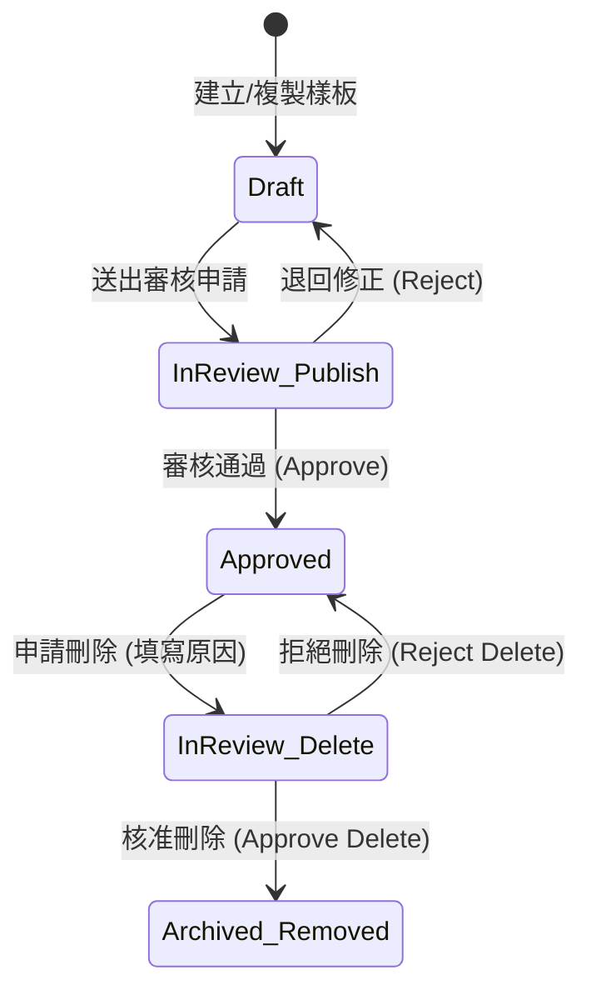

# ADR 0008: SQL Template 權限治理體系、樣板複製 (Duplicate) 與刪除審核流程架構設計

- **狀態**：Accepted (已採用)
- **日期**：2026-08-28
- **決策者**：DataStudio 前端架構與資料治理團隊
- **相關議題**：SQL Template 權限細粒度控制、樣板深拷貝衍生草稿、刪除審核狀態機流轉、Admin 全域代審機制、審核清單聯集運算、自訂確認 Modal 替代原生對話框

---

## 1. 背景與問題陳述 (Context & Problem Statement)

在企業級數據資產管理平台中，SQL 樣板直接對接底層資料庫與對外 API 調用，具備高度敏感性與業務依賴性。原系統存在以下權限與流程架構缺陷：

1. **狀態與編修權限脫鉤**：
   - 審核中（`In Review`）的樣板未被強制鎖定，建立者仍可進入編輯，導致送審版本與實際修改內容不一致。
2. **缺乏樣板快速複製（Duplicate）機制**：
   - 使用者欲在既有樣板基礎上微調時，需手動重新複製 SQL、欄位定義與動態參數，效率低且容易遺漏 PII 標記。
3. **刪除缺乏審核治理（Delete Governance）**：
   - 既有實作直接物理刪除樣板，缺乏主管/資料治理團隊的覆核流程，容易造成線上相依系統異常中斷。
4. **角色邊界模糊與代審缺失**：
   - 審核中心僅依賴指派人（`assignee`）嚴格比對，治理主管（Admin）無法跨指派代為審核同仁送審之緊急樣板。
5. **審核清單過濾語意不精確**：
   - 「全部審核清單」直接抓取全平台資料庫，未遵循「待我審核」與「我的送審紀錄」之不重複聯集語意。
6. **瀏覽器原生 `window.confirm()` 不穩定**：
   - 在全螢幕 Modal 浮層環境下，原生 confirm 對話框容易因瀏覽器焦點切換而閃退。

---

## 2. 決策考量因素 (Decision Drivers)

- **資料安全與合規性 (Security & Governance)**：任何已發布或審核中樣板的下線/刪除必須具備完整稽核軌跡（Audit Trail）。
- **流程確定性 (Process Determinism)**：審核中樣板不可編輯；審核視窗動作按鈕必須精準依據當前用戶身分（審核者 vs 送審者 vs 管理員）隔離呈現。
- **使用者操作流暢度 (UX Flow & Continuity)**：Duplicate 樣板後需自動轉化為獨立 Draft 並無縫進入 SQL Studio 工作台。
- **介面穩定度 (UI Robustness)**：全面捨棄瀏覽器阻塞式原生 API，統一採用企業級自訂 Modal 對話框。

---

## 3. 決策結果 (Decision Outcome)

### 3.1 角色職責模型 (Role Responsibility Matrix)

| 角色標籤 | 代表人物 | 職責定義 | 關鍵權限 |
| :--- | :--- | :--- | :--- |
| **Admin** | `Sarah Wu (Governance Lead)` | 平台資料治理主管 | 全域樣板檢視、刪除申請審核、跨指派代人審核、建立/複製/編輯 |
| **Reviewer** | `John Doe (Data Architect)` | 專職架構審核人 | 審核指派給自己的樣板（架構、效能、憑證）、自建樣板編輯/複製 |
| **User** | `Alex Chen (Data Engineer)` `Emily Lin (FinTech)` | 樣板建立與開發者 | 自建樣板草稿/發布版編輯、樣板複製 (Duplicate)、申請刪除樣板 |

---

### 3.2 狀態機與刪除審核流轉 (State Machine & Deletion Flow)

樣板狀態機擴充支援 `reviewType: 'delete'` 審核子狀態：

1. **申請刪除**：設定 `reviewStatus: 'In Review'`, `reviewType: 'delete'`, `usageStatus: 'Disabled'`，寫入時間軸歷史紀錄。
2. **核准刪除**：由 Admin / 主管點擊「核准刪除」，樣板自資產庫正式移除或封存。
3. **退回刪除**：填寫退回原因，狀態還原為 `Approved`，`usageStatus: 'Active'`，樣板繼續提供調用。

---

### 3.3 樣板複製機制 (Duplicate Pattern)

- **ID 演算法**：自動探測現有 ID，依序生成 `${original_id}_COPY`、`${original_id}_COPY_1`...
- **資料深拷貝**：完整複製 rawSql、templateSql、columns（含 PII 標籤）、parameters 等設定。
- **狀態重置**：強制將 `reviewStatus` 設為 `Draft`、`author` 變更為當前操作者、清空審核歷程、重設版本歷史為 v1。
- **導航行為**：即時寫入 Store 並自動路由導向 `StudioView`（`mode: 'edit'`）進入編修。

---

### 3.4 審核中心清單過濾與聯集模型 (Review Center Union Model)

1. **待我審核 (`assigned`)**：
   - 條件：`reviewStatus === 'In Review'`
   - 普通 Reviewer / User：僅取 `assignee === currentUser`。
   - Admin：取得全平台所有 `In Review` 項目（實現全域代審）。
2. **我的送審紀錄 (`my`)**：
   - 條件：`isAuthor(tpl, currentUser)`。
3. **全部審核清單 (`all`)**：
   - 採用 **Map 鍵值去重聯集**：`Union(getAssignedPendingList(), getMySubmissionsList())`，避免出現當前使用者既無權審核亦非作者的無關項目。

---

### 3.5 審核 Modal 動作按鈕動態呈現矩陣

| 開啟來源 / 狀態 | 當前用戶身分 | 【編輯】 | 【退回 (Reject)】 | 【核准發布 / 刪除】 | 【關閉】 |
| :--- | :--- | :---: | :---: | :---: | :---: |
| **待我審核** | Reviewer / Admin | 隱藏 | 顯示 | 顯示 | 顯示 |
| **我的送審** (`Draft` / `Approved`) | 建立者 / Admin | 顯示 | 隱藏 | 隱藏 | 顯示 |
| **我的送審** (`In Review`) | 建立者 (非 Admin) | 隱藏 (鎖定) | 隱藏 | 隱藏 | 顯示 |
| **全部審核** (待審項目) | 審核人 / Admin | 隱藏 | 顯示 | 顯示 | 顯示 |
| **全部審核** (自建項目) | 建立者 | 依狀態顯示 | 隱藏 | 隱藏 | 顯示 |

---

### 3.6 自訂確認對話框組件 (`ModalManager.showConfirmModal`)

全面替換原生 `confirm()`，具備以下特性：
- 支援 `danger` (紅色警告)、`warning` (琥珀色提示)、`primary` (標準操作) 三種主題。
- 獨立於其他 Modal 容器，設定 `z-index: 10000` 與獨立半透明遮罩，解決全螢幕視窗下的對話框閃退問題。

---

## 4. 架構影響與優缺點分析 (Pros and Cons)

### 正面影響 (Pros)
- **資產合規性大幅提升**：樣板刪除全面受控，審核中樣板徹底防篡改。
- **權限與職責分明**：Admin 專注宏觀治理與代審，Reviewer 專注架構評估，User 專注生產與維護。
- **操作體驗一致性**：自訂確認框與各 Tab 專屬按鈕大幅降低操作混淆。

### 負面影響 / 權衡 (Cons & Mitigations)
- **狀態判斷邏輯增多**：UI 需要即時計算 `canEdit`、`canDelete`、`canReview`。
  - *緩解措施*：統一將邏輯封裝在 `DataStore` 類別內，View 層僅需呼叫純粹的 Helper 方法。

---

## 5. 相關模組 (Related Modules)

- `js/store.js`：權限 Helper、樣板複製、刪除申請與狀態機轉移
- `js/components/modal.js`：`showDeleteModal` 與 `showConfirmModal`
- `js/views/catalog.js`：樣板目錄刪除狀態呈現、複製與刪除申請入口
- `js/views/review.js`：審核中心聯集計算、動態動作按鈕與審核/退回事件
- `css/review.css`：Toolbar 佈局修復與使用者切換標籤樣式
- `index.html`：各 Modal DOM 結構與全域角色切換選單
